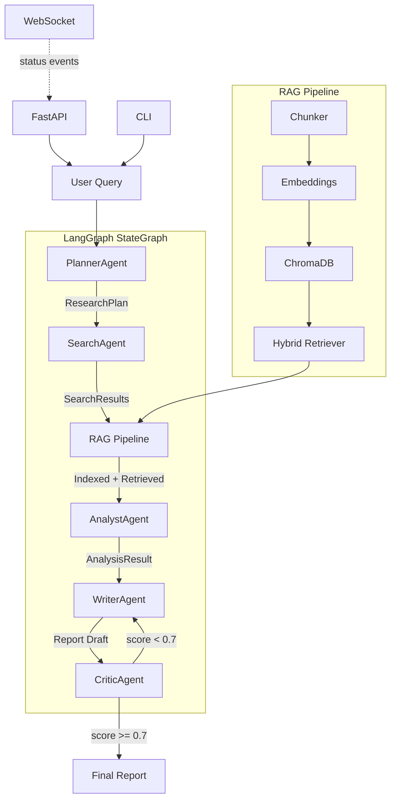

# Multi-Agent Research Assistant

A system that orchestrates specialized AI agents to research any topic, synthesize findings across sources, and produce structured reports with source attribution and confidence scoring.

## Architecture



## Features

- **Five specialized agents** working in a directed graph: Planner decomposes queries, Searcher gathers sources (Tavily + DuckDuckGo fallback), Analyst extracts claims with confidence scoring, Writer produces cited reports, Critic evaluates and triggers revisions.
- **LangGraph orchestration** with conditional edges: automatic revision loop when critique score falls below threshold (configurable, default 0.7), max 2 revision cycles.
- **Hybrid RAG pipeline**: sentence-transformers embeddings (all-MiniLM-L6-v2, runs locally) + BM25 sparse retrieval via rank_bm25, stored in ChromaDB. Cross-references findings across all sub-tasks.
- **LiteLLM gateway**: single interface to OpenAI, Anthropic, and local models. Automatic fallback, retry with exponential backoff, cost tracking per request.
- **Real-time streaming**: WebSocket endpoint pushes phase transitions, progress, and errors as they happen.
- **Three output formats**: Markdown (default), structured JSON, rendered HTML. Reports include executive summary, cited key findings, contradictions, and source reliability assessments.
- **Contradiction detection**: cross-source analysis flags conflicting claims with explanations and source links.
- **Rate limiting** (slowapi), CORS, RFC 7807 error responses.
- **Zero external dependencies for search**: DuckDuckGo fallback works without any API key.

## Quick Start

With Docker (recommended):

```bash
cp .env.example .env
# Edit .env — at minimum set OPENAI_API_KEY or ANTHROPIC_API_KEY
docker-compose up --build -d
curl http://localhost:8080/health
```

## Local Development

```bash
python -m venv .venv
source .venv/bin/activate  # Windows: .venv\Scripts\activate
pip install -e ".[dev]"
cp .env.example .env
# Edit .env with your API keys

# Run the API server
uvicorn src.api.main:app --reload --port 8080

# Or use the CLI
python -m src.cli.app research "What are the latest advances in quantum computing?" --depth standard
```

## CLI Usage

```bash
# Run research with live progress dashboard
python -m src.cli.app research "Impact of AI on healthcare" --depth deep --model gpt-4o

# List past research tasks from this session
python -m src.cli.app list

# Display a specific report
python -m src.cli.app show cli-1709312345

# Export report to file
python -m src.cli.app export cli-1709312345 --format markdown --output report.md
python -m src.cli.app export cli-1709312345 --format json --output report.json
python -m src.cli.app export cli-1709312345 --format html --output report.html
```

Example output during research:

```
╭─ Research Assistant ──────────────────────────╮
│ Query: Impact of AI on healthcare             │
│ Depth: deep                                   │
│ Model: gpt-4o                                 │
╰───────────────────────────────────────────────╯
  ✓ Planning completed (2.1s)
  ✓ Searching completed (8.4s)
  ✓ Analyzing completed (5.2s)
  ✓ Writing completed (6.8s)
  ✓ Critiquing completed (3.1s)
  ✓ Revising completed (5.5s)
  ✓ Critiquing completed (2.9s)

╭─ AI in Healthcare: Transforming Diagnosis... ─╮
│ # Executive Summary                           │
│ ...                                            │
╰────────────────────────────────────────────────╯
```

## API Documentation

The API server exposes interactive docs at `http://localhost:8080/docs` (Swagger UI) and `http://localhost:8080/redoc`.

### Start a research task

```bash
curl -X POST http://localhost:8080/research \
  -H "Content-Type: application/json" \
  -d '{"query": "Current state of fusion energy research", "depth": "standard"}'

# Response: {"task_id": "a1b2c3d4e5f6", "status": "pending", "message": "..."}
```

### Poll status

```bash
curl http://localhost:8080/research/a1b2c3d4e5f6

# Response includes current_phase, progress timings, partial results
```

### Get the final report

```bash
# Markdown (default)
curl http://localhost:8080/research/a1b2c3d4e5f6/report

# JSON
curl "http://localhost:8080/research/a1b2c3d4e5f6/report?format=json"

# HTML
curl "http://localhost:8080/research/a1b2c3d4e5f6/report?format=html"
```

### WebSocket streaming

```javascript
const ws = new WebSocket("ws://localhost:8080/research/a1b2c3d4e5f6/stream");
ws.onmessage = (event) => {
  const data = JSON.parse(event.data);
  console.log(`[${data.type}]`, data.data);
  // {"type": "phase_start", "data": {"phase": "planning", "details": "..."}}
  // {"type": "phase_end", "data": {"phase": "planning", "duration": 2.1}}
  // {"type": "complete", "data": {"task_id": "a1b2c3d4e5f6"}}
};
```

### Health check

```bash
curl http://localhost:8080/health

# {"status": "healthy", "version": "0.1.0", "dependencies": {"redis": "ok", "chromadb": "ok", ...}}
```

## Configuration

| Variable | Default | Description |
|---|---|---|
| `DEFAULT_MODEL` | `gpt-4o-mini` | Default LiteLLM model identifier |
| `FALLBACK_MODEL` | `gpt-3.5-turbo` | Fallback model on primary failure |
| `LLM_TEMPERATURE` | `0.3` | LLM sampling temperature |
| `LLM_MAX_TOKENS` | `4096` | Max tokens per LLM call |
| `LLM_TIMEOUT` | `120` | LLM call timeout (seconds) |
| `LLM_MAX_RETRIES` | `3` | Retry attempts per call |
| `OPENAI_API_KEY` | | OpenAI API key |
| `ANTHROPIC_API_KEY` | | Anthropic API key |
| `TAVILY_API_KEY` | | Tavily search API key (optional, DuckDuckGo fallback available) |
| `REDIS_URL` | `redis://localhost:6379/0` | Redis connection URL |
| `USE_FAKEREDIS` | `true` | Use fakeredis for local dev |
| `CHROMA_HOST` | `localhost` | ChromaDB host |
| `CHROMA_PORT` | `8000` | ChromaDB port |
| `CHROMA_USE_LOCAL` | `true` | Use local ephemeral ChromaDB |
| `EMBEDDING_MODEL` | `all-MiniLM-L6-v2` | Sentence-transformers model |
| `EMBEDDING_DEVICE` | `cpu` | Device for embeddings (cpu/cuda) |
| `CHUNK_SIZE` | `512` | Text chunk size (characters) |
| `CHUNK_OVERLAP` | `64` | Overlap between chunks |
| `API_HOST` | `0.0.0.0` | API server bind address |
| `API_PORT` | `8080` | API server port |
| `CORS_ORIGINS` | `["*"]` | Allowed CORS origins |
| `RATE_LIMIT` | `30/minute` | API rate limit |
| `DEFAULT_DEPTH` | `standard` | Default research depth |
| `MAX_REVISION_CYCLES` | `2` | Max writer-critic revision loops |
| `CRITIQUE_THRESHOLD` | `0.7` | Minimum critique score to skip revision |

## Testing

```bash
# All tests
pytest --cov=src --cov-report=term-missing tests/

# Unit tests only
pytest tests/unit/ -v

# Integration tests only
pytest tests/integration/ -v

# Specific test file
pytest tests/unit/test_planner.py -v
```

Test structure:
- `tests/unit/` — isolated agent tests with mocked LLM, RAG component tests
- `tests/integration/` — full graph flow with mocked LLM, FastAPI TestClient tests
- `tests/conftest.py` — shared fixtures: mock LLM factory, sample data (plans, search results, analysis, reports, critiques)

## How It Works

A query flows through the system like this:

1. **Planning**: The PlannerAgent receives "What are the environmental impacts of Bitcoin mining?" and decomposes it into 5 sub-tasks: energy consumption data, geographic distribution of mining, renewable energy adoption, e-waste concerns, comparison with traditional banking. Each sub-task gets a priority and dependency order.

2. **Search**: The SearchAgent runs each sub-task query through Tavily (if API key configured) with DuckDuckGo fallback. For a "standard" depth query, it retrieves up to 5 results per sub-task. URLs are deduplicated. Source reliability is assessed heuristically (academic domains > news > blogs).

3. **RAG Indexing**: All retrieved content is chunked (512 chars, 64 overlap, boundary-aware splitting), embedded via all-MiniLM-L6-v2, and stored in a per-session ChromaDB collection. A hybrid retriever (60% dense cosine + 40% BM25) enables cross-referencing across sub-tasks.

4. **Analysis**: The AnalystAgent processes all search results plus RAG cross-references. It extracts factual claims with source URLs, assigns confidence (high = 3+ sources agree, medium = 2, low = 1), flags contradictions between sources, and identifies gaps.

5. **Writing**: The WriterAgent takes the analysis and produces a report with executive summary, numbered key findings with inline citations, contradictions section, open questions, and source list with reliability ratings. Output is both structured JSON and Markdown.

6. **Critique**: The CriticAgent scores the report 0.0-1.0 across multiple dimensions: source support, logical consistency, perspective coverage, bias detection. If score < 0.7, the report loops back to the WriterAgent with specific revision suggestions. Maximum 2 revision cycles.

7. **Delivery**: The final report is available via REST API (markdown/json/html), WebSocket (streamed events during processing), or CLI (rich terminal output).

## Tech Stack

| Component | Choice | Why |
|---|---|---|
| Orchestration | LangGraph StateGraph | Typed state, conditional edges, built for agent workflows |
| LLM Interface | LiteLLM | Single API for OpenAI/Anthropic/local models, cost tracking |
| Data Models | Pydantic v2 | Runtime validation, JSON schema generation, serialization |
| Vector Store | ChromaDB | Lightweight, embeddable, good Python API |
| Embeddings | sentence-transformers | Local execution, no API key, good quality/speed tradeoff |
| Sparse Search | rank_bm25 | BM25 for keyword matching alongside dense retrieval |
| API Framework | FastAPI | Async, WebSocket support, auto-generated docs |
| HTTP Client | httpx | Async, connection pooling, timeout handling |
| CLI | Typer + Rich | Type-safe CLI with live dashboards and formatted output |
| Task Queue | Redis/fakeredis | Production queue with zero-config local fallback |
| Search | Tavily + DuckDuckGo | Primary paid API + free fallback for zero-config usage |

## Contributing

1. Fork the repository and create a feature branch.
2. Install dev dependencies: `pip install -e ".[dev]"`
3. Make changes with tests: `pytest tests/ -v`
4. Ensure code quality: `ruff check src/ tests/ && mypy --strict src/`
5. Use conventional commits: `feat:`, `fix:`, `refactor:`, `docs:`, `test:`
6. Open a PR against `main`.

## License

MIT License. See [LICENSE](LICENSE) for details.


---

Built by [BitSharp](https://bitsharp.pl) - AI solutions for Polish businesses.
